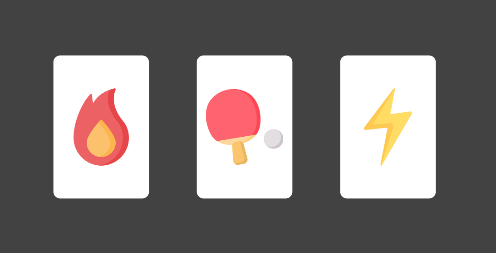
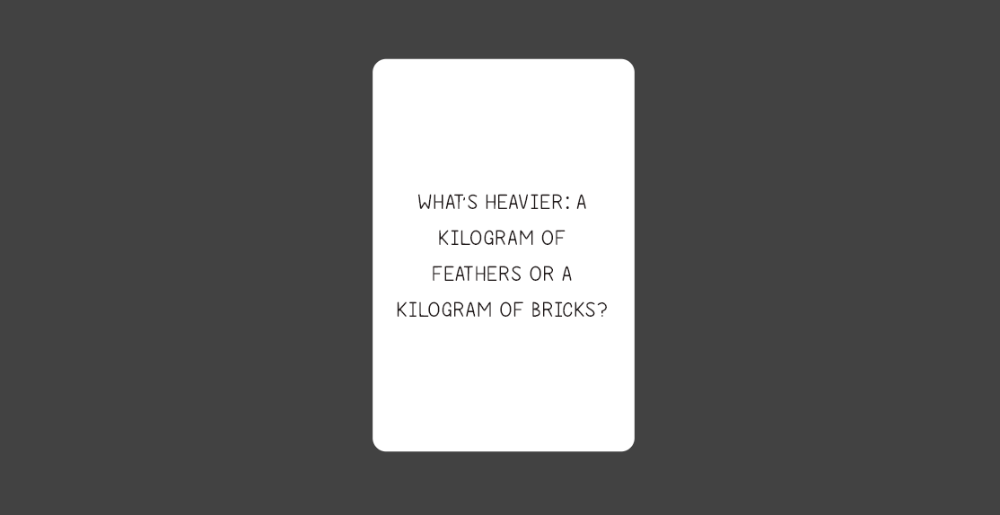

# BrainKick

BrainKick is a quick-and-easy dueling style party game which runs on a variety of platforms (iOS, Android, Web, Windows). The game consists of a ongoing series of rounds in which one player challenges another. Whichever player wins the duel gets a point while the loser gets endless shame. The winner of the duel then picks another player to challenge and so on..

***Players:** 3+*\
***Complexity:** 1/5*\
***Time:** However long you want*

## Try it out
Visit:
https://henkehagfeldt.github.io/brainkick-flutter/

## Rules

The rules are quite simple and can be broken down into X steps.

1. **Pick a starting player** 🙋\
The first player to start as the challenger can be decided based on any relevant trait (hottest brain, most burning hair, abundance of brain cells, etc..)

2. **Pick a starting announcer** 🎤\
The announcer will be responsible for reading the challenge out loud so that no both players get the information at the same time.

3. **Challenge someone** 🆚\
The challenger picks another player (which isn't the announcer) in which to challenge in a duel.

4. **Pick a category** 🃏\
The challenger picks one of the three available options of cards (Burning Brain 🧠, Ping-pong 🏓 or Lightning ⚡).

5. **Read the challenge** 📢\
The announcer flips the card over to reveal the challenge and reads it out loud and clear for both dueling parties to hear.

6. **Decide a winner** 🏆\
The announcer decides who won the challenge based on the challenge type.

7. **Prepare for the next round** 🔀 \
Before the next rounds starts, rotate the player roles as following:
   * The winner becomes (or stays) the challenger.
   * The loser becomes the new announcer.

8. **Repeat** 🔁\
You are now ready to start the next round and the game keeps going from step 3 → 8 until everyone's brains are fully cooked.

## Card Types
Currently, there are three card categories to pick from when challenging someone and they all have different rules that decides how to win that particular challenge.

### Burning Brain 🧠
In this challenge a claim is presented and both players need to pick a side, wether to agree or disagree with the claim. It's first come first serve, so be quick if you want to get your preferred side.

When both players are in disagreement on the claim, it's time to start the argument, it doesn't have to make sense or reflect your real opinions, have fun with it and get creative!

Winning the challenge can happen in a number of ways.
1. You get your opponent to laugh. 🤣
2. Your opponent can't come up with anything to say. 😶
3. Your opponent agrees with your arguments. 🤯

**Example**\
*Claim: Bananas are actually just yellow sausages.*

*Player 1*\
Yes, I agree. If you think about it they taste just the same, the only difference is the color.

*Player 2*\
That's ridiculous, sausages are made from meat and bananas are fruit, they are completely different!

*Player 1*\
If you think about it, the pulp is kind of the meat of the banana which makes it even more clear that it is the same thing as a sausage.

*Player 2*\
... ???

**Player 1 wins!** 👑

### Ping-pong 🏓
In the ping-pong challenge, a category is presented and both parties need to, one after the other, come up with an items that fits the category. The challenger begins and then the two parties takes turn until one of them is victorious.

You can win in two ways:
1. Your opponent mentions an item that has already been mentioned. 🔁
2. Your opponent takes too long to come up with the next item. ⏳

**Example**\
*Category: Movies*

*Player 1*\
Die Hard.

*Player 2*\
..Madagascar!

*Player 1*\
Titanic!

*Player 2*\
... Die Hard!

*Player 1*\
I already said that one!

**Player 1 wins!** 👑

### Lightning ⚡
The lightning challenge will present the two players with an quick and easy question and the goals is simply to answer it correctly as fast as possible. Sometimes there is more than one answer and sometimes the questions can be a bit tricky.

You win by answering the question correctly before your opponent. In case of a tie, pull another lightning card.

**Example**\
*Question: What is Queen Elizabeths first name?*

*Player 2*\
Elizabeth!

**Player 2 wins!** 👑
